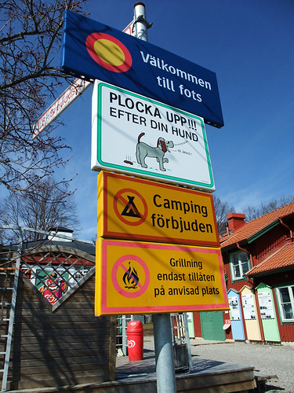
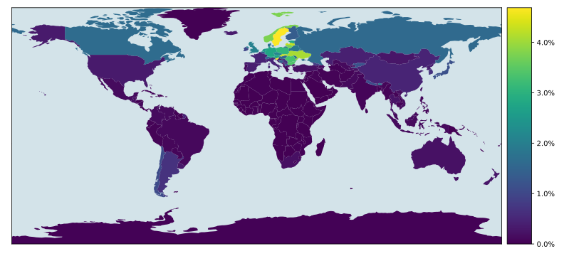
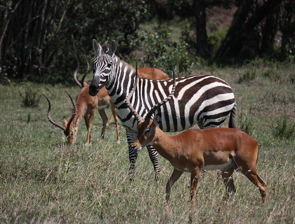
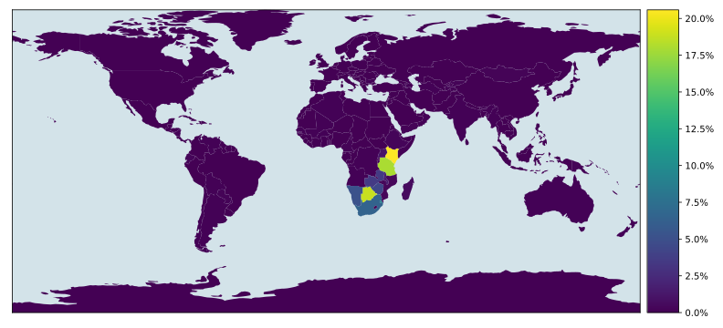
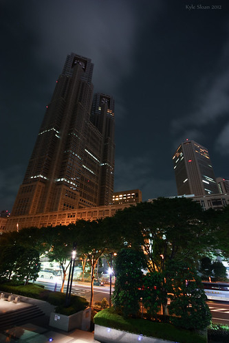
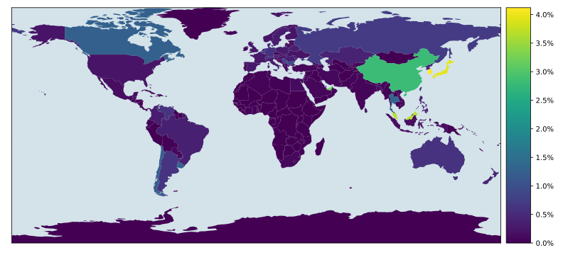
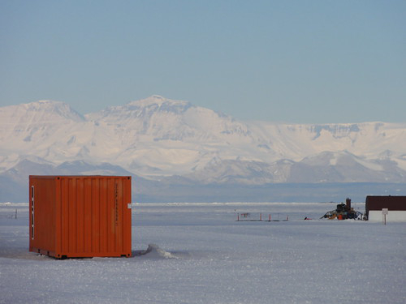
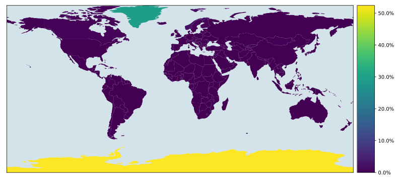

# Country Classifier

A convolutional neural network (CNN) model for determining the country a photo
was taken in.

## Usage

The `country-classifier` directory contains 4 files:

- `config.py`
- `train.py`
- `test.py`
- `predict.py`

To train a model, set the configuration variables in `config.py` and run
`train.py`. The training run data and the best model are saved in the
provided directory (`runs` by default).

The trained model can be evaluated on the test set by providing the path to the
saved `state_dict.pt` file in `config.py` and running `test.py`.

Run `predict.py` after setting the relevant variables in `config.py` to make
predictions with the model. The model outputs the top `k` (5 by default) most
likely countries for the given image, as well as a
[choropleth map](https://en.wikipedia.org/wiki/Choropleth_map) of the
predicted probabilities for each country. The shapefiles used to generate the
map, from [Natural Earth](https://www.naturalearthdata.com/downloads/10m-cultural-vectors/10m-admin-0-countries/),
are located in the `shapefiles` directory.

## Dataset

The [Country211](https://github.com/openai/CLIP/blob/main/data/country211.md)
dataset from OpenAI was used to train the model. The dataset contains 63,300
images from 211 countries, with 150 train images, 50 validation images, and
100 test images for each country. The provided splits were used.

## Model

A pretrained [EfficientNet](https://arxiv.org/abs/1905.11946) model was used
as a base for transfer learning. Training a model from scratch was deemed
infeasible, especially considering the small size of the dataset. 8 
variations of EfficientNet models are available, increasing in size from
EfficientNet-B0 to EfficientNet-B7. The largest model that could be trained
without running out of memory on the available RTX 3080 10 GB GPU was
EfficientNet-B2, so this was chosen for training.

## Training

Several transfer learning approaches were tried, including:

- Training all layers with a uniform learning rate
- Training all layers, but using different learning rates for the `features`
  and `classifier` parts of the model
- Training only the `classifier` part of the model and freezing the other
  layers

The first approach produced the best results.

Early stopping was used to prevent overfitting, and the train set was augmented
with horizontal flips. Additional augmentations were also tried but did not
seem to improve the model's performance.

The `state_dict.pt` file for the final model can be found in the `models`
directory.

## Results

The model achieved the following performance on the test set:

- Accuracy: 13.7%
- Top-5 accuracy: 29.6%

Unsurprisingly, the model performs best on pictures taken outside and those
containing distinct natural features, compared to indoor photos or close-up
images of objects. A curated set of images from the test set and the model's
predictions for them are shown below.

### Sweden

| Photo                  | Top-5 Predictions                                                                                    |
|------------------------|------------------------------------------------------------------------------------------------------|
|  | 1. Sweden: 4.7% 2. Slovenia: 4.7% 3. Slovakia: 4.3% 4. Latvia: 4.3% 5. Ukraine: 4.1% |

| Prediction map         |
|------------------------|
|  |

### Kenya

| Photo                 | Top-5 Predictions                                                                                          |
|-----------------------|------------------------------------------------------------------------------------------------------------|
|  | 1. Kenya: 20.6% Botswana: 18.9% 3. Tanzania: 18.0% 4. Eswatini: 8.9% 5. South Africa: 6.5% |

| Prediction map        |
|-----------------------|
|  |

### Japan

| Photo                 | Top-5 Predictions                                                                                       |
|-----------------------|---------------------------------------------------------------------------------------------------------|
|  | 1. Hong Kong: 20.9% Macao: 17.5% 3. Singapore: 9.9% 4. South Korea: 4.1% 5. Japan: 4.0% |

| Prediction map        |
|-----------------------|
|  |

### Antarctica

| Photo                      | Top-5 Predictions                                                                                        |
|----------------------------|----------------------------------------------------------------------------------------------------------|
|  | 1. Antarctica: 52.4% Greenland: 28.9% 3. Svalbard: 4.8% 4. Norway: 2.3% 5. Andorra: 1.6% |

| Prediction map             |
|----------------------------|
|  |

## Future work

The greatest limitation of the model seems to be the training data, both in
terms of size and quality. The Country211 dataset only contains 150 train set
images for each country, and many of the images fall into the following
categories:

- Indoor photo not representative of the country
- Close-up photo of a ubiquitous object
- Digitally created (not a photograph)
- Incorrectly labeled (taken in a different country)

These images hinder the model's training, so the preparation of any new dataset
should be done with care so that these kinds of images are excluded. A model
trained on such a dataset, preferably with a large number of images, will be
able to achieve improved performance.
